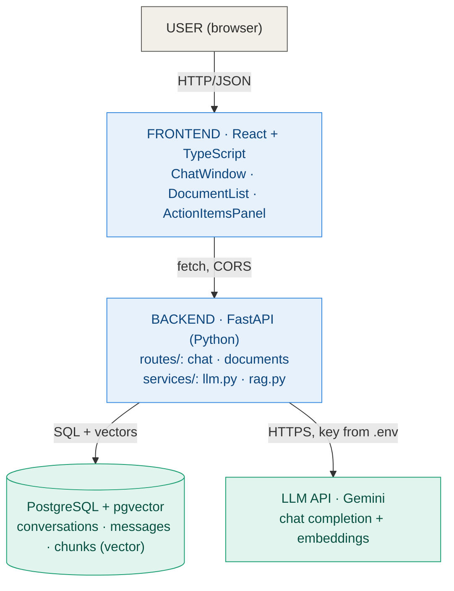
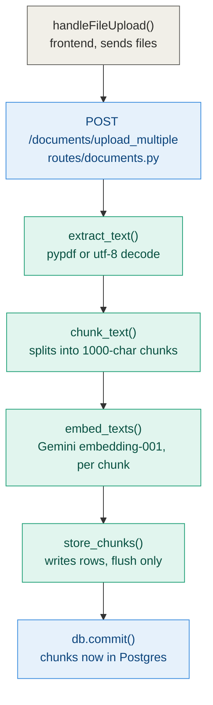
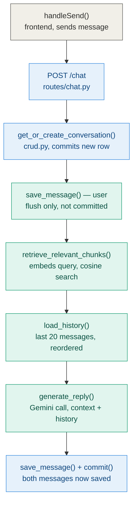
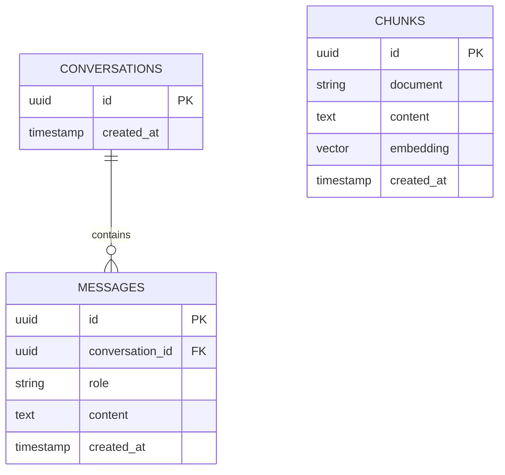

# Architecture — Smart Support Assistant

A RAG-backed support assistant: users upload documents, the backend chunks and embeds them into PostgreSQL via `pgvector`, and chat questions are answered by retrieving the most relevant chunks and passing them to an LLM (Google Gemini) alongside conversation history.

---

## 1. System architecture

**Ingest** (once per document): `upload → extract → chunk → embed → store`
**Answer** (per question): `embed question → cosine similarity search (top-k) → augment prompt with retrieved context → LLM → reply`

Two lifecycles, one shared database — every conversation can draw on every previously uploaded document.

---

## 2. Request lifecycles

### 2.1 Document ingestion

Runs once per uploaded file, triggered from the document upload panel.

Re-uploading a file with the same name replaces its chunks (delete-then-insert inside `store_chunks()`) rather than duplicating them. The whole per-file loop stays uncommitted until every file succeeds, so a multi-file upload is atomic.

### 2.2 Chat request (question → answer)

Runs on every message sent, whether starting a new conversation or continuing one.

The user's message is flushed (not committed) before retrieval and generation run, so `load_history()` can see it — but nothing is permanent until the assistant's reply is also saved. A failed Gemini call rolls both back, leaving no orphaned question with no answer.

---

## 3. Data model

`chunks` intentionally has no foreign key into `conversations` or `messages` — it's a flat, document-scoped knowledge base. Every conversation retrieves from the same pool of chunks, which is what lets a document be uploaded once and referenced across any number of future conversations. `embedding` is a 3072-dimension `pgvector` column, populated by `gemini-embedding-001`.

---

## 4. Module reference

### Backend

**`app/main.py`** — Application entry point. Instantiates the FastAPI app, configures CORS for the Vite dev origin, mounts the `chat` and `documents` routers, and calls `Base.metadata.create_all(engine)` so tables are created automatically at startup.

**`app/database.py`** — Owns the SQLAlchemy engine and session factory pointed at the `pgvector`-enabled Postgres container. Defines `get_db()`, the generator-based dependency every route uses via `Depends(get_db)` to receive a session that is guaranteed to close after the request, success or failure.

**`app/config.py`** — Single source of truth for environment-driven configuration: the Gemini API key, the configurable retrieval depth `RETRIEVER_K`, and the loader for the system prompt text file. No other module reads `os.environ` directly.

**`app/models.py`** — SQLAlchemy ORM definitions for `Chunk`, `Conversation`, and `Message` — the schema that `main.py` turns into real Postgres tables on startup.

**`app/schemas.py`** — Pydantic request/response contracts (`ChatRequest`, `ChatResponse`, `UploadResponse`, `DocumentListResponse`, etc.) that FastAPI uses for automatic validation and for the generated docs at `/docs`.

**`app/crud.py`** — The database access layer: creating/looking up conversations, saving and loading messages, listing documents and recent conversations, deleting rows. Contains no HTTP or AI logic. Message writes use `db.flush()` rather than `db.commit()`, deferring the actual commit to the calling route.

**`app/services/llm.py`** — The only module that talks to the Gemini API: chat completion (`gemini-2.5-flash`), embeddings (`gemini-embedding-001`), and structured action-item extraction. Every SDK-level exception is translated into a single `LLMError`, so callers only ever handle one failure type.

**`app/services/rag.py`** — The retrieval-augmented-generation core. `chunk_text()` splits raw text into overlapping 1000-character windows; `store_chunks()` embeds and persists them with delete-then-insert semantics; `retrieve_relevant_chunks()` embeds an incoming question and runs a `pgvector` cosine-distance nearest-neighbor query for the top-k most relevant chunks.

**`app/routes/chat.py`** — HTTP layer for the conversational surface: `POST /chat`, `GET /chat/{id}/history`, `GET /conversations`, `DELETE /chat/{id}`. Orchestrates `crud` and `services` calls and maps failures to the correct HTTP status codes (502/503/500).

**`app/routes/documents.py`** — HTTP layer for document management: multi-file upload, listing, action-item extraction, and deletion. Extracts PDF/plain-text content inline before handing it to `services/rag.py`.

### Frontend

**`src/App.tsx`** — The entire client application in one component: chat window, message input, conversation sidebar with resume/delete, document upload and management panel, and the action-items side panel. Owns all client state and every network call.

**`src/services/api.ts`** — A single configured `axios` instance (`baseURL` from `VITE_API_URL`) that every frontend request goes through.

---

## 5. Tech stack

| Layer | Technology |
|---|---|
| Frontend | React 19 + TypeScript, Vite |
| Backend | FastAPI, SQLAlchemy |
| Database | PostgreSQL 16 with `pgvector`, via Docker Compose |
| LLM | Google Gemini — `gemini-2.5-flash` (generation), `gemini-embedding-001` (embeddings) |

---

## 6. Known limitations

- `sources` in the chat response is currently a placeholder, not wired to the actual retrieved chunk filenames.
- Retrieval embeds only the latest message, not the full conversation — follow-up questions rely on the LLM's own memory more than on retrieval.
- No approximate-nearest-neighbor index (`ivfflat`/`hnsw`) yet; cosine search is a brute-force scan, fine at current scale.
- Embeddings are generated one chunk at a time rather than batched.
